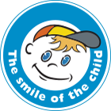

# The Smile of the Child

"[The Smile of the Child](https://www.hamogelo.gr/gr/en/poioi-eimaste/)" was created in 1995 by 10-year-old Andreas Yannopoulos, who, shortly before leaving from life, expressed in his diary his wish to found an organization that will ensure for all children what he had so generously enjoyed: love, affection, care and respect.

The financial data of the Organization is publicized on an annual basis and is audited by International Body of Auditors of Ernst and Young.

---

### Please consider donating; there are [many ways](https://www.hamogelo.gr/gr/en/stirikste-mas/) to do so.

_Note: `j4rs` is not affiliated with "The Smile of the Child", we just want to help and contribute to the longevity of the organization._